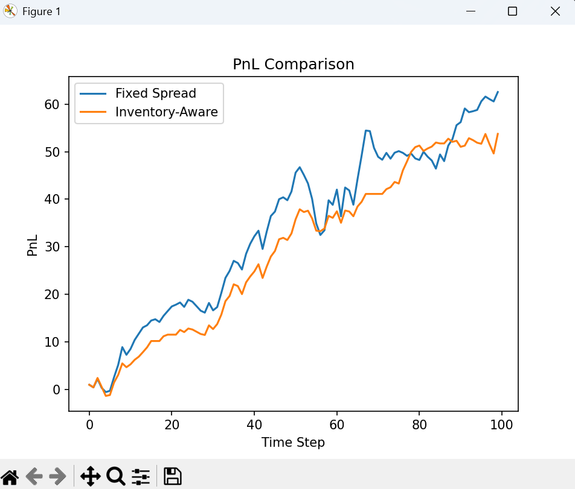
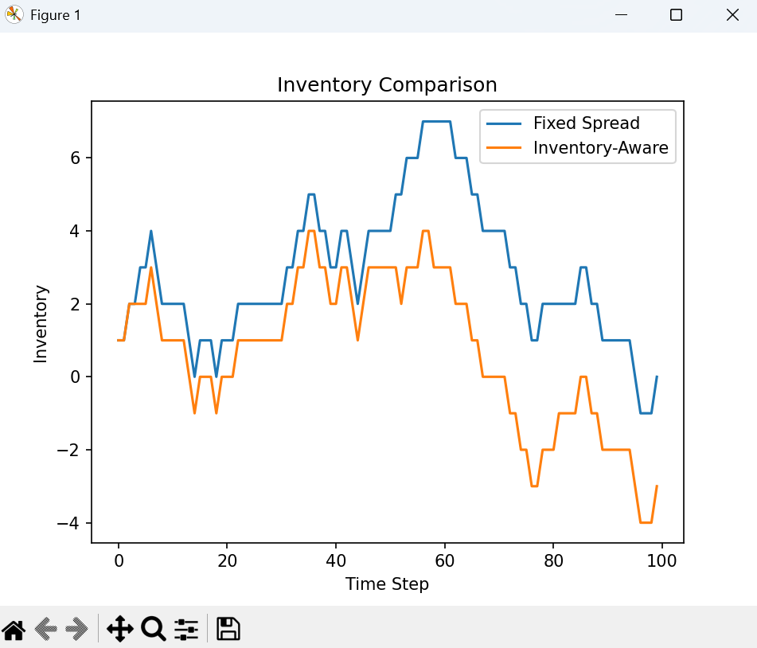
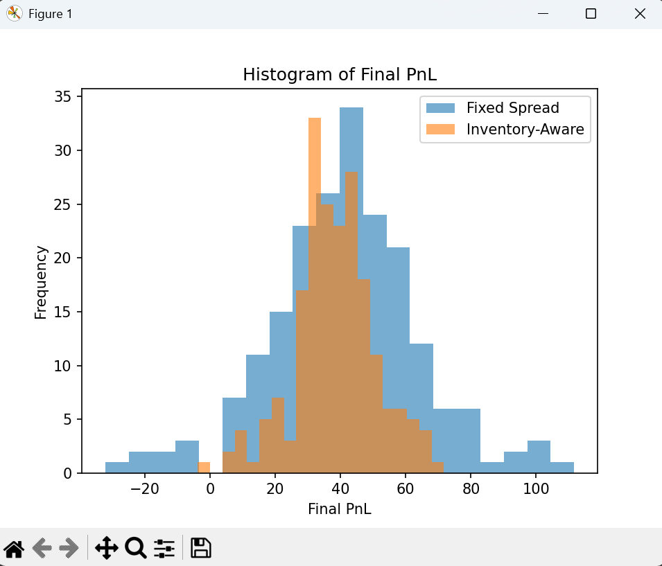
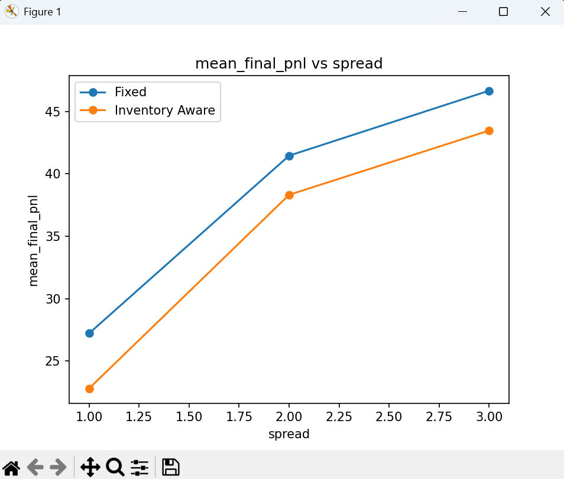
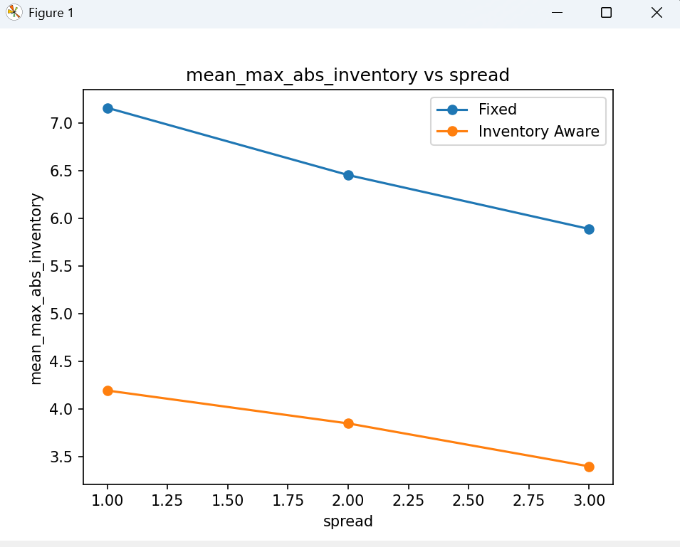

# Market Making Simulator

A Python market making simulator that compares a **fixed spread strategy** against an **inventory-aware strategy** under shared simulated market conditions.

Built to demonstrate:
- Clean separation between **simulation**, **strategy**, **metrics**, **experiments**, and **plotting**
- Reproducible experiments using fixed random seeds
- Single-run and multi-run strategy comparisons
- Parameter sweeps across settings such as spread
- A simple **adverse selection** extension where fills predict unfavorable next-step price drift

---

## Key Takeaway

This project compares a fixed spread market maker with an inventory-aware market maker under the same simulated random seeds. The main result is that inventory-aware quoting can reduce inventory risk and often improve outcome stability by shifting quotes in response to current position. The simulator also shows how results change across parameter settings and how performance degrades once a simple adverse selection mechanism is introduced.

---

## What This Project Does

This simulator models a market maker quoting a bid and ask around a simulated mid price. At each time step, the simulator:

1. Updates the mid price using a stochastic process
2. Applies optional adverse-selection drift based on the previous step's fill
3. Asks the chosen strategy for bid/ask quotes
4. Converts those quotes into probabilistic fill chances
5. Simulates bid/ask fills
6. Updates cash, inventory, and mark-to-market PnL
7. Stores histories for analysis

The project supports four kinds of evaluation:

| Mode | Description |
|---|---|
| **Single-run comparison** | One seed, sample path plots |
| **Multi-run comparison** | Many seeds, summary statistics |
| **Parameter sweep** | Vary settings like spread across a range |
| **Scenario comparison** | With vs. without adverse selection |

---

## Strategies Compared

### 1. Fixed Spread

Always quotes symmetrically around the current mid price:

```
bid = mid - spread / 2
ask = mid + spread / 2
```

Does not react to inventory.

### 2. Inventory-Aware

Shifts the quote center based on current inventory:

```
adjusted_mid = mid - inventory_skew × inventory
bid = adjusted_mid - spread / 2
ask = adjusted_mid + spread / 2
```

**Interpretation:**
- If inventory is too **positive** → lowers both quotes to encourage selling
- If inventory is too **negative** → raises both quotes to encourage buying

---

## Model Assumptions

This simulator is intentionally simplified. Key assumptions:

- Mid price evolves in **discrete time** following a **stochastic process**
- Quotes are updated **every time step**
- Fills are **probabilistic**, based on quote attractiveness relative to mid
- Each fill has **size 1**
- **No fees, no latency, no queue position modeling, no real order book**

PnL is marked to market as:

```
PnL = cash + inventory × mid
```

> This is not a realistic production trading model. It is a compact educational simulator for experimenting with basic market making ideas.

### Fill Model

Fill probability depends on quote aggressiveness relative to mid:

```
bid_fill_prob = base_fill_probability + fill_sensitivity × (bid - mid)
ask_fill_prob = base_fill_probability + fill_sensitivity × (mid - ask)
```

Both probabilities are clamped to `[0, 1]`.

- A **higher bid** is more aggressive → more likely to be filled
- A **lower ask** is more aggressive → more likely to be filled

### Adverse Selection Model

The simulator includes an optional adverse selection extension. The intuition:

- If your **bid** gets filled → the next price move is slightly more likely to be **down**
- If your **ask** gets filled → the next price move is slightly more likely to be **up**

This is implemented as a drift applied to the next step's price move:

```
move = rng.uniform(-volatility, volatility) + adverse_drift
price += move
```

Where `adverse_drift` is set based on the previous fill:

| Previous fill | `adverse_drift` |
|---|---|
| Bid filled | `-adverse_selection_strength` |
| Ask filled | `+adverse_selection_strength` |
| No fill (or both) | `0` |

This makes fills less "free", introduces a simple version of informed flow, and lets the project compare strategy behavior in a more hostile environment.

---

## Metrics Reported

Computed over many random seeds so the comparison reflects a distribution of outcomes rather than one lucky path.

| Metric | Description |
|---|---|
| Mean final PnL | Average final PnL across runs |
| Std final PnL | Outcome variability |
| Mean max absolute inventory | Average peak inventory exposure |
| Mean fills | Average number of fills |
| Profitable run % | Fraction of runs with positive final PnL |
| Best run | Highest final PnL observed |
| Worst run | Lowest final PnL observed |

---

## Evaluation Modes

### 1. Single-Run Plots

Inspect one sample path under a fixed seed:
- PnL path
- Inventory path
- Optional mid-price path
- Optional adverse-drift path

### 2. Multi-Run Strategy Comparison

Runs both strategies over many seeds and prints a summary table.

### 3. Parameter Sweep

Varies one parameter (e.g. spread) across several values and compares both strategies at each setting. Example questions this can answer:
- What happens to fills as spread widens?
- Does inventory-aware quoting help more at tighter or wider spreads?
- How does mean PnL change as quoting becomes less aggressive?

### 4. Scenario Comparison

Compares **No Adverse Selection** vs. **Adverse Selection** for both strategies under the same number of runs — useful for isolating baseline behavior from performance under a simple execution penalty.

---

## Project Structure

```
market_maker_sim/
├── main.py          # Entry point — runs experiments, prints tables, calls plots
├── config.py        # Default parameters, sweep settings, and scenario definitions
├── simulator.py     # Core simulation loop for one run
├── strategies.py    # Quote generation logic for each strategy
├── metrics.py       # One-run metrics: final PnL, max inventory, etc.
├── experiments.py   # Multi-run logic, parameter sweeps, scenario comparison, formatted tables
├── plots.py         # Plotting helpers for sample paths, histograms, sweep charts
└── README.md
```

---

## How to Run

**1. Install dependencies**

```bash
pip install matplotlib
```

**2. Run the project**

```bash
python main.py
```

Depending on what is enabled in `main.py`, this can:
- Run the default multi-run strategy comparison
- Print a clean summary table
- Run a parameter sweep
- Run an adverse-selection scenario comparison
- Display sample path or histogram plots

---

## Example Outputs

### Strategy Comparison

```
Strategy comparison over 200 runs

Strategy          Mean PnL    Std PnL    Mean Max Inv    Mean Fills    Profitable %    Best Run    Worst Run
------------------------------------------------------------------------------------------------------------
Fixed                 1.24       4.51            8.03         42.18           61.00%       12.77        -9.42
Inventory-Aware       2.87       3.76            5.41         39.64           71.50%       11.93        -4.08
```

### Parameter Sweep (spread)

```
Parameter sweep: spread over 200 runs per setting

spread    Strategy          Mean PnL    Std PnL    Mean Max Inv    Mean Fills    Profitable %    Best Run    Worst Run
----------------------------------------------------------------------------------------------------------------------
1.00      Fixed                  ...
1.00      Inventory-Aware        ...
2.00      Fixed                  ...
2.00      Inventory-Aware        ...
3.00      Fixed                  ...
3.00      Inventory-Aware        ...
```

### Scenario Comparison

```
Scenario comparison over 200 runs per scenario

Scenario                Strategy          Mean PnL    Std PnL    Mean Max Inv    Mean Fills    Profitable %    Best Run    Worst Run
------------------------------------------------------------------------------------------------------------------------------------
No Adverse Selection    Fixed                  ...
No Adverse Selection    Inventory-Aware        ...
Adverse Selection       Fixed                  ...
Adverse Selection       Inventory-Aware        ...
```

---

## Example Visualisations

Suggested charts for portfolio screenshots:

- PnL comparison on one sample path
- Inventory comparison on one sample path
- Histogram of final PnL across many runs
- Mean final PnL vs. spread (parameter sweep)
- Mean max absolute inventory vs. spread
- Mid-price / adverse drift path when adverse selection is enabled







---

## What I Found

In general, the inventory-aware strategy tends to:

- Reduce extreme inventory accumulation
- Produce lower average inventory risk
- Shift fill behavior by making one side more aggressive depending on current position
- Often improve outcome stability relative to a purely fixed spread strategy

Key observations from the parameter sensitivity analysis:

- **Wider spreads** → fewer fills
- **Stronger inventory skew** → more aggressive inventory mean-reversion
- **Higher fill sensitivity** → quote placement matters more
- **Adverse selection** → lowers profitability and makes market making less forgiving

The scenario comparison is one of the most useful extensions: without adverse selection, market making can look artificially generous. Once adverse selection is turned on, fills can be followed by unfavorable price drift — giving a more honest test of whether inventory-aware quoting actually helps.

---

## Why This Project Is Useful

This project demonstrates:

- Decomposition of strategy logic from simulation logic
- Reproducible experiments using seeded randomness
- Strategy comparison under shared market scenarios
- Parameter sensitivity analysis
- A simple microstructure-inspired adverse selection extension
- Clean Python project structure rather than a monolithic script

---

## Limitations

This is a simplified educational simulator. It does not model:

- Queue priority or exchange matching rules
- Latency and stale quotes
- Transaction fees or rebates
- Inventory limits
- Dynamic spread optimization
- A true limit order book
- Realistic informed flow (the adverse selection model only affects the next step, uses a fixed drift magnitude, and does not capture different order sizes, news, or richer order flow structure)

---

## Possible Extensions

- Transaction fees / maker rebates
- Inventory limits
- Volatility or fill sensitivity sweeps
- Sweep over `inventory_skew`
- Alternative price processes (mean reversion, jump-diffusion)
- Export experiment summaries to CSV
- Unit tests for strategies, metrics, and experiments
- More realistic order-flow and execution models
- Simple order book or queue-based extension

---

## Notes

This is an educational simulator, not a real trading system. Its goal is to make core market making trade-offs easy to reason about: spread capture, inventory risk, quote aggressiveness, repeated-run evaluation, parameter sensitivity, and the effect of simple adverse selection.